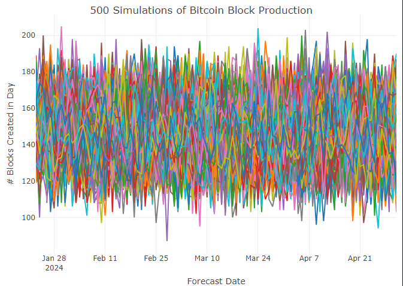
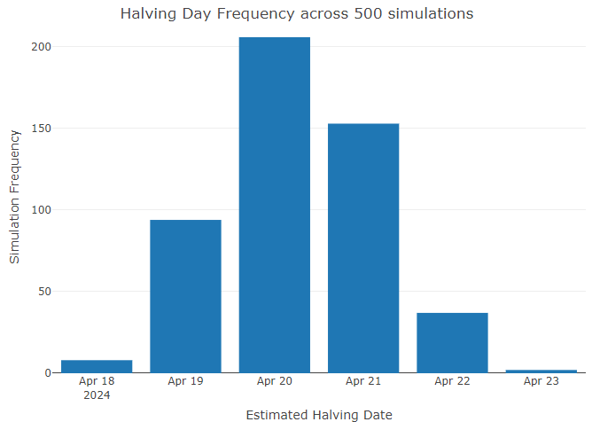

# Forecasting the next Bitcoin Halving

All data is provided in the repo. Simply clone the repo, make sure you have `renv` downloaded, and restore().

``` r

require(renv)
renv::restore()
```

From there you can open `predicting_btc_halvening.Rmd` and run.

# Results

Doing 500 simulations of bitcoin blocks made each day (trained over the 365 days before 2024-01-23), the most likely date is April 20th.

[]

90.6% of the simulations had the Halving on April 19th (3rd), 20th (1st), or 21st (2nd).



# Flipside Crypto

Flipside Pro offers professional access to Flipside Crypto data including custom views, curations, and integration into our existing SDK using a private Large Snowflake warehouse.

You can sign up for a free trial and learn more about Flipside Pro here: <https://flipsidecrypto.xyz/pricing>
